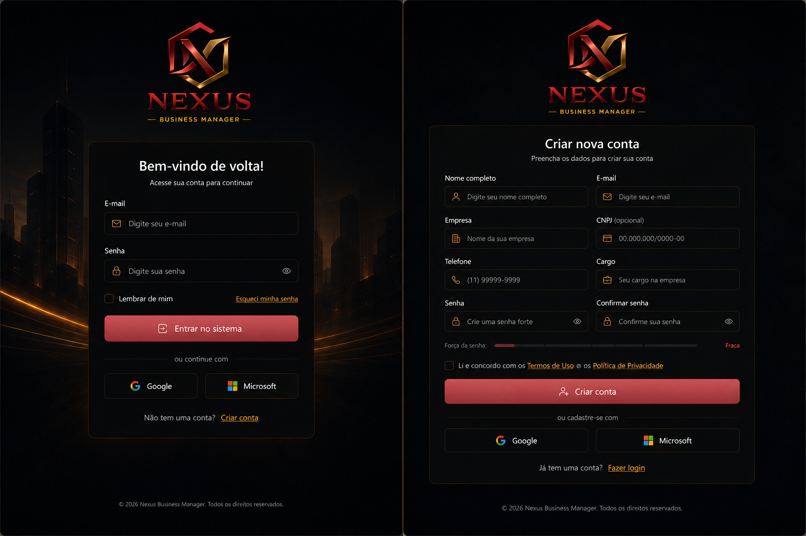
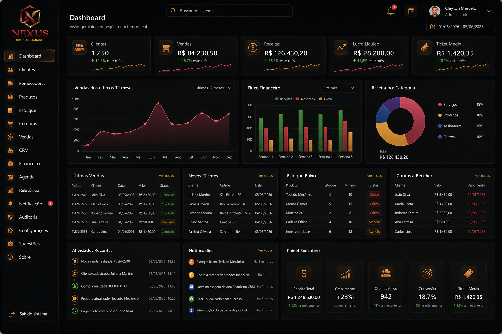
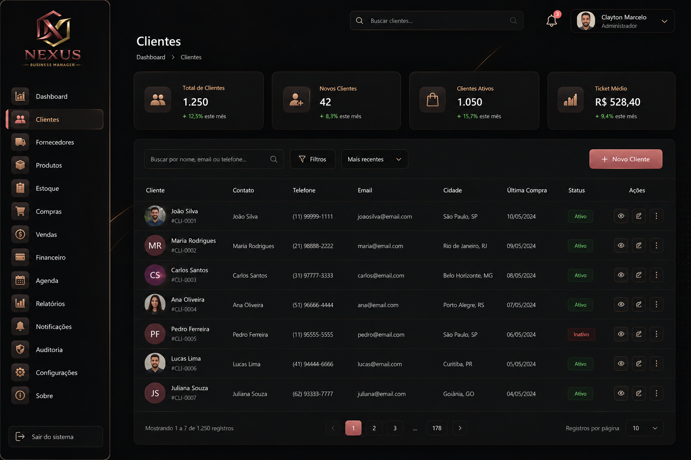
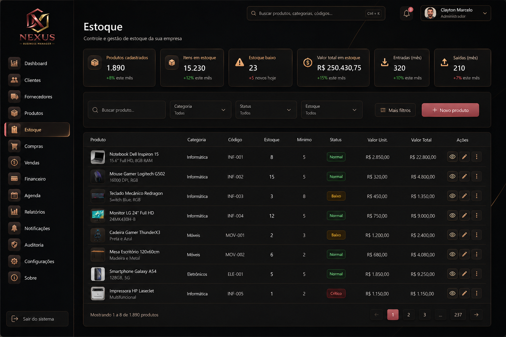
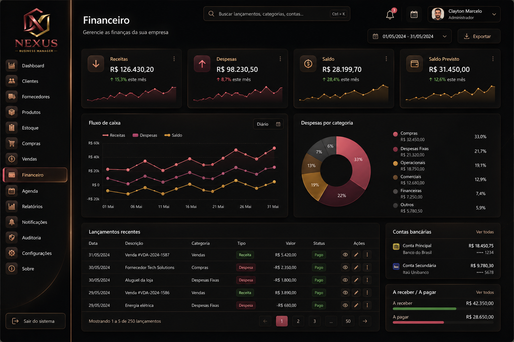
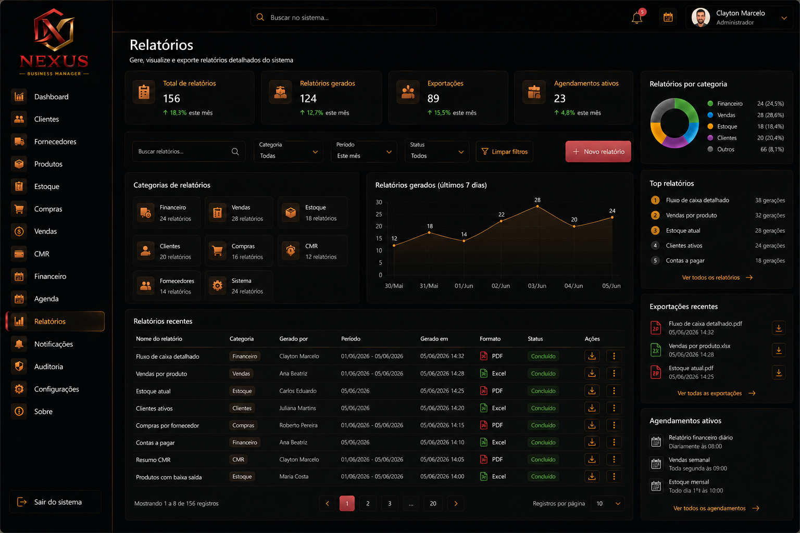

<p align="center">
  
</p>

<h1 align="center">Nexus Business Manager</h1>

<p align="center">
  <strong>Complete SaaS ERP for Business Management</strong><br>
  Modern system to centralize CRM, Inventory, Purchases, Sales, Financial, Scheduling, Reports and Multi-company in a single platform.
</p>

<p align="center">
  <a href="README.md">
    
    Português
  </a>
  |
  
  <strong>English</strong>
</p>

<p align="center">
  <a href="./LICENSE"></a>
  
  
  
  
  
  
  
</p>

---

## Screenshots

> Screenshots can be generated by running the project locally. See the guide at [`docs/screenshots/README.md`](docs/screenshots/README.md).

<div align="center">

| Login | Dashboard |
|:-----:|:---------:|
|  |  |

| CRM | Inventory |
|:---:|:---------:|
|  |  |

| Financial | Reports |
|:---------:|:-------:|
|  |  |

</div>

---

## About the Project

**Nexus Business Manager** is a complete SaaS ERP system designed for small and medium businesses that need a unified management solution.

### Problem it solves

Small businesses often use isolated tools for each area: one system for clients, a spreadsheet for inventory, another for finances, and a separate calendar. This creates rework, inconsistent data, and wasted time.

Nexus unifies **everything in a single system** with centralized data, web and mobile access, multi-user support, and complete data isolation between companies.

### Target audience

- Retail and wholesale stores
- Service providers (workshops, clinics, offices)
- Small manufacturers and distributors
- Freelance professionals
- Accounting offices

### Benefits

- **Centralization**: All data in one place
- **Cost savings**: Replaces multiple paid tools
- **Scalability**: Architecture ready to grow
- **Multi-company**: Manage as many companies as you need
- **Open source**: Freedom to customize and extend

---

## Features

### Authentication
- Secure login with JWT
- Token-based session control
- Password recovery support

### Users
- Full registration with profiles
- Role hierarchy: admin, manager, operator, viewer
- User activation/deactivation

### CRM
- Client registration with search and pagination
- Sales history per client
- Client status (active/inactive)

### Products
- Registration with unique SKU
- Categories and pricing
- Product image support

### Inventory
- Inbound and outbound movements
- Quantity control per product
- Low stock alerts
- Complete movement history

### Suppliers
- Registration with contact information
- Search by name and document

### Purchases
- Multi-item orders
- Partial receiving
- Status: pending, received, cancelled
- Automatic stock update on receiving

### Sales
- Multi-item registration
- Automatic stock deduction
- Client linking
- Status: open, completed, cancelled

### Financial
- Revenue and expenses
- Cash flow management
- Customizable categories
- Status: pending, paid, overdue, cancelled
- Cash flow report

### Appointments
- Service calendar
- Client linking
- Date filter
- Status: scheduled, completed, cancelled

### Dashboard
- KPIs: clients, products, sales, low stock
- Revenue vs expenses monthly chart
- Monthly sales chart
- Products by category chart
- Total stock value

### Reports
- Reports in JSON, PDF, and Excel
- Types: clients, products, financial, stock, sales
- Direct browser download

### Notifications
- Low stock alerts
- Due bill alerts
- Today's schedule alerts
- Mark as read / read all

### Audit
- All actions logged (create, update, delete)
- Login and logout logging
- Report export logging
- User IP recorded

### Multi-company
- Complete isolation via `company_id`
- Companies don't see each other's data
- Company registration and management

---

## Implemented Modules

| Module | Status |
|----------|--------|
| Authentication | ✅ |
| Users | ✅ |
| CRM | ✅ |
| Products | ✅ |
| Inventory | ✅ |
| Suppliers | ✅ |
| Purchases | ✅ |
| Sales | ✅ |
| Financial | ✅ |
| Appointments | ✅ |
| Dashboard | ✅ |
| Reports | ✅ |
| Notifications | ✅ |
| Audit | ✅ |
| Multi-company | ✅ |

---

## Tech Stack

### Backend
| Technology   | Purpose                     |
|--------------|-----------------------------|
| Node.js      | JavaScript runtime          |
| Fastify      | HTTP framework              |
| TypeScript   | Static typing               |
| JWT          | Stateless authentication    |
| Zod          | Schema validation           |
| bcryptjs     | Password hashing            |
| mysql2       | MySQL driver                |
| Prisma       | ORM (auth module)           |

### Frontend
| Technology   | Purpose                     |
|--------------|-----------------------------|
| React 18     | UI library                  |
| Vite         | Bundler and dev server      |
| Tailwind CSS | Styling framework           |
| React Native | Mobile app                  |
| Recharts     | Charts and graphs           |
| Axios        | HTTP client                 |

### Database
| Technology   | Purpose                     |
|--------------|-----------------------------|
| MySQL 8+     | Relational database         |
| Migrations   | Schema evolution            |
| Seeds        | Initial data                |

### DevOps
| Technology      | Purpose                     |
|-----------------|-----------------------------|
| Git             | Version control             |
| GitHub Actions  | CI/CD                       |
| Vitest          | Unit tests                  |

---

## Folder Structure

```
nexusbusinessmanager/
├── backend/
│   ├── src/
│   │   ├── modules/
│   │   ├── shared/
│   │   └── tests/
│   └── database/
│       └── migrations/
├── frontend/
│   └── src/
│       ├── pages/
│       ├── components/
│       └── contexts/
├── mobile/
├── database/
├── docs/
│   ├── en/
│   └── screenshots/
├── assets/
└── .github/
    └── workflows/
```

---

## Multi-company

Nexus Business Manager was designed with native **multi-company support** (SaaS multi-tenant).

### How it works

1. Every data table has a `company_id` column
2. Every SQL query includes `WHERE company_id = ?`
3. The JWT token contains the logged user's `companyId`
4. The authentication middleware extracts and forwards the `company_id` automatically

### Isolation

- Companies **do not view** other companies' data
- Users belong to a single company
- Company management is handled by the administration module
- Ideal for franchises, business groups, and SaaS providers

---

## Security

The project implements multiple security layers:

| Layer           | Description                                  |
|-----------------|----------------------------------------------|
| **JWT**         | Tokens with configurable expiration          |
| **bcryptjs**    | Secure password hashing with salt            |
| **Rate Limit**  | 100 requests/min global, 5 login attempts    |
| **Helmet**      | Security HTTP headers (XSS, CSP, HSTS)       |
| **Zod**         | Strict input validation                      |
| **Permissions** | Hierarchy admin > manager > operator > viewer|
| **Audit**       | All actions logged with IP and timestamp     |
| **CORS**        | Controlled allowed origins                   |

---

## Architecture

```text
┌─────────────────────────────┐
│ Frontend                    │
│ React + TypeScript          │
└─────────────┬───────────────┘
              │
              â–¼
┌─────────────────────────────┐
│ Backend API                 │
│ Fastify + Node.js           │
│ JWT + Zod + Prisma          │
└─────────────┬───────────────┘
              │
              â–¼
┌─────────────────────────────┐
│ Business Modules            │
│ CRM • Inventory • Sales     │
│ Financial • Reports         │
│ Notifications • Audit       │
│ Multi-company               │
└─────────────┬───────────────┘
              │
              â–¼
┌─────────────────────────────┐
│ MySQL 8                     │
│ Multi-tenant Database       │
└─────────────────────────────┘
```

### Security

* JWT Authentication
* Rate Limiting
* Helmet
* CORS
* Permission Hierarchy
* Multi-company Isolation

### Architecture

* React Frontend
* Fastify Backend
* MySQL Database
* REST API
* Multi-company via company_id

### Scalability

* Modular architecture
* Domain separation
* SaaS-ready
* Ready for future integrations

---

## Database

The project uses **MySQL 8+** as its relational database.

### Migrations

Migrations are in `backend/database/migrations/` and run in numeric order:

```bash
npm run migrate
```

### Seeds

The initial seed creates the admin user and default company:

```bash
npm run seed
```

The demo seed populates the database with realistic data (clients, products, sales, etc.):

```bash
npm run demo-seed
```

---

## Installation

### Prerequisites

- Node.js >= 20
- MySQL >= 8.0
- Git
- npm (included with Node.js)

### Step by step

```bash
# 1. Clone the repository
git clone https://github.com/claytonmarcelo/Nexus-Business-Manager.git
cd nexusbusinessmanager

# 2. Set up the MySQL database
mysql -u root -p < database/schema.sql

# 3. Install and start the backend
cd backend
npm install
cp .env.example .env
# Edit the .env file with your credentials

npm run migrate
npm run seed
npm run dev

# 4. In another terminal, install and start the frontend
cd frontend
npm install
npm run dev
```

The API will be available at `http://localhost:3333` and the frontend at `http://localhost:5173`.

### Demo data

```bash
cd backend
npm run demo-seed
```

Access with:
- **Email:** `admin@nexusdemo.com`
- **Password:** `123456`

---

## Configuration

### Environment Variables

Create a `.env` file in the `backend/` folder based on `.env.example`:

```env
PORT=3333
JWT_SECRET=your_secret_here
JWT_EXPIRES_IN=8h
LOG_LEVEL=debug
NODE_ENV=development

DB_HOST=localhost
DB_PORT=3306
DB_NAME=nexus_business_manager
DB_USER=root
DB_PASSWORD=
```

---

## Documentation

Complete documentation is available in the `docs/` folder:

| Document                  | Description                        |
|---------------------------|------------------------------------|
| [Architecture](docs/en/architecture.md) | System diagrams and flows        |
| [Deployment](docs/en/deployment.md)     | Production deployment guide      |
| [Backup](docs/en/backup.md)             | Database backup and restore      |
| [Monitoring](docs/en/monitoring.md)     | Health check and logs            |
| [Tests](docs/en/tests.md)               | Test execution and coverage      |
| [Use Cases](docs/en/use-cases.md)       | Real-world application examples  |
| [Demo Account](docs/demo-account.md)    | Demo credentials                 |
| [License (EN)](docs/en/license-en.md)   | MIT License explanation          |

---

## Roadmap

### Completed
- [x] Project foundation (structure, design system, database)
- [x] Authentication (login, JWT, permissions)
- [x] Dashboard with KPIs and charts
- [x] Full CRM (clients, history)
- [x] Inventory control (products, movements)
- [x] Financial management (accounts, cash flow)
- [x] Scheduling (calendar, events)
- [x] Multi-company architecture (SaaS)
- [x] Exportable reports (PDF, Excel)
- [x] Notifications and audit
- [x] CI/CD pipeline
- [x] Automated unit tests
- [x] Complete bilingual documentation
### Future

#### Phase 9 — App Marketplace

Future area to enable integration of modules, extensions and external services into Nexus Business Manager.

**Possibilities:**

* WhatsApp integrations
* Google Calendar
* Google Drive
* PIX
* Stripe
* Mercado Pago
* Internal apps
* Business plugins
* Per-company extensions

> Status: Planned

#### Phase 10 — BI and Business Intelligence

Future strategic analysis layer to transform operational data into management indicators.

**Possibilities:**

* Advanced dashboards
* Custom KPIs
* Comparative charts
* Sales analysis
* Financial analysis
* Stock forecasting
* Executive reports
* Analytical export

> Status: Planned

---

## Demo

### Online Demo

> *Coming soon: link to online demonstration.*

In the meantime, you can run the project locally:

```bash
git clone https://github.com/claytonmarcelo/Nexus-Business-Manager.git
cd nexusbusinessmanager
cd backend && npm install && npm run dev
# In another terminal:
cd frontend && npm install && npm run dev
```

Access `http://localhost:5173` and log in with:
- **Email:** `admin@nexusdemo.com`
- **Password:** `123456`

---

## 👨‍💻 Developer

<table>
  <tr>
    <td width="90">
      
    </td>
    <td>
      <strong>C. Marcelo Dev.</strong><br>
      <strong>📍</strong> Brazil<br><br>
      <a href="https://github.com/claytonmarcelo" target="_blank">
        
      </a>
      <a href="https://www.youtube.com/@c.marcelodev.brasil" target="_blank">
        
      </a>
      <a href="https://cmarcelodev.com" target="_blank">
        
      </a>
      <a href="https://www.linkedin.com/in/clayton-marcelo-dev/" target="_blank">
        
      </a>
      <br><br>
      <em>
        Full Stack Developer specialized in React, React Native, Node.js,
        Fastify, TypeScript, MySQL and enterprise SaaS solutions development.
      </em>
    </td>
  </tr>
</table>

---

## License

This project is licensed under the **MIT License** — see the [LICENSE](LICENSE) file for details.

Read the simplified explanation:

* [Português](docs/license-pt-br.md)
* [English](docs/en/license-en.md)

---

<p align="center">
  <em>Built with dedication by <strong>C. Marcelo Dev. Brazil</strong>.</em>
  <br>
  <a href="https://github.com/claytonmarcelo/Nexus-Business-Manager">🔗 GitHub</a>
</p>

