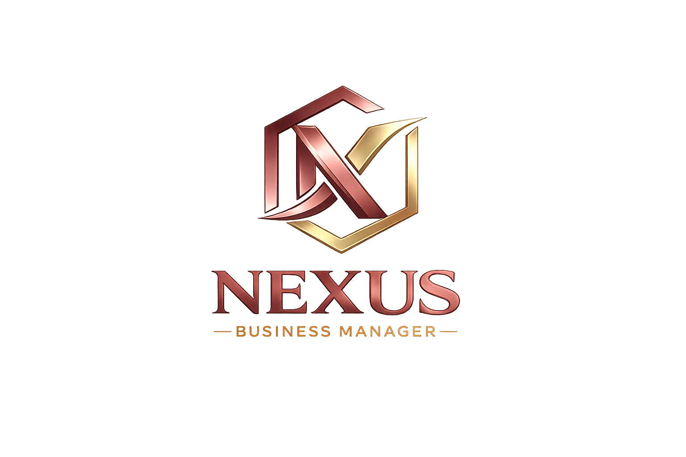

<p align="center">
  
</p>

<h1 align="center">Nexus Business Manager</h1>

<p align="center">
  <strong>ERP SaaS Completo para Gestão Empresarial</strong><br>
  Sistema moderno para centralizar CRM, Estoque, Compras, Vendas, Financeiro, Agendamentos, Relatórios e Multiempresa em uma única plataforma.
</p>

<p align="center">
  <a href="README.md">🇧🇷 Português</a> |
  🇺🇸 <strong>English</strong>
</p>

<p align="center">
  <a href="./LICENSE"></a>
  
  
  
  
  
  
  
</p>

---
## Screenshots

> Capturas ilustrativas da interface do Nexus Business Manager.

<div align="center">

|                               Login                              |                                 Dashboard                                |
| :--------------------------------------------------------------: | :----------------------------------------------------------------------: |
|  |  |

|                              CRM Clientes                              |                                Estoque                               |
| :--------------------------------------------------------------------: | :------------------------------------------------------------------: |
|  |  |

|                                 Financeiro                                 |                                 Relatórios                                 |
| :------------------------------------------------------------------------: | :------------------------------------------------------------------------: |
|  |  |

</div>

---
---

## Sobre o Projeto

O **Nexus Business Manager** é um sistema ERP SaaS completo desenvolvido para atender pequenas e médias empresas que precisam de uma solução unificada de gestão.

### Problema que resolve

Pequenas empresas frequentemente utilizam ferramentas isoladas para cada área: um sistema para clientes, uma planilha para estoque, outro para finanças e uma agenda separada. Isso gera retrabalho, dados inconsistentes e perda de tempo.

O Nexus unifica **tudo em um único sistema**, com dados centralizados, acesso web e mobile, suporte a múltiplos usuários e isolamento completo entre empresas.

### Público-alvo

- Lojas de varejo e atacado
- Prestadores de serviços (oficinas, consultórios, escritórios)
- Pequenas indústrias e distribuidoras
- Profissionais autônomos
- Escritórios de contabilidade

### Benefícios

- **Centralização**: Todos os dados em um só lugar
- **Economia**: Substitui múltiplas ferramentas pagas
- **Escalabilidade**: Arquitetura preparada para crescer
- **Multiempresa**: Gerencie quantas empresas precisar
- **Código aberto**: Liberdade para customizar e estender

---

## Funcionalidades

### Autenticação
- Login seguro com JWT
- Controle de sessão por token
- Suporte a recuperação de senha

### Usuários
- Cadastro completo com perfis
- Hierarquia de permissões: admin, manager, operator, viewer
- Ativação/desativação de usuários

### CRM
- Cadastro de clientes com busca e paginação
- Histórico de vendas por cliente
- Status de cliente (ativo/inativo)

### Produtos
- Cadastro com SKU único
- Categorias e preços
- Controle de imagem do produto

### Estoque
- Movimentações de entrada e saída
- Controle de quantidade por produto
- Alerta de estoque baixo
- Histórico completo de movimentações

### Fornecedores
- Cadastro com dados de contato
- Busca por nome e documento

### Compras
- Pedidos com múltiplos itens
- Recebimento parcial
- Status: pendente, recebida, cancelada
- Atualização automática de estoque ao receber

### Vendas
- Registro com múltiplos itens
- Baixa automática de estoque
- Vínculo com cliente
- Status: aberta, concluída, cancelada

### Financeiro
- Receitas e despesas
- Fluxo de caixa
- Categorias personalizáveis
- Status: pendente, pago, vencido, cancelado
- Relatório de fluxo de caixa

### Agendamentos
- Calendário de serviços
- Vínculo com clientes
- Filtro por data
- Status: agendado, concluído, cancelado

### Dashboard
- Indicadores: clientes, produtos, vendas, estoque baixo
- Gráfico de receitas x despesas por mês
- Gráfico de vendas por mês
- Gráfico de produtos por categoria
- Valor total em estoque

### Relatórios
- Relatórios em JSON, PDF e Excel
- Tipos: clientes, produtos, financeiro, estoque, vendas
- Download direto pelo navegador

### Notificações
- Alertas de estoque baixo
- Alertas de contas a vencer
- Alertas de agenda do dia
- Marcar como lida / ler todas

### Auditoria
- Registro de todas as ações (criação, alteração, exclusão)
- Registro de login e logout
- Registro de exportação de relatórios
- IP do usuário registrado

### Multiempresa
- Isolamento completo por `company_id`
- Empresas não visualizam dados umas das outras
- Cadastro e gerenciamento de empresas

---

## Módulos Implementados

| Módulo       | Status |
|--------------|--------|
| Autenticação | ✅      |
| Usuários     | ✅      |
| CRM          | ✅      |
| Produtos     | ✅      |
| Estoque      | ✅      |
| Fornecedores | ✅      |
| Compras      | ✅      |
| Vendas       | ✅      |
| Financeiro   | ✅      |
| Agendamentos | ✅      |
| Dashboard    | ✅      |
| Relatórios   | ✅      |
| Notificações | ✅      |
| Auditoria    | ✅      |
| Multiempresa | ✅      |

---

## Tecnologias

### Backend
| Tecnologia   | Finalidade                  |
|--------------|-----------------------------|
| Node.js      | Runtime JavaScript          |
| Fastify      | Framework HTTP              |
| TypeScript   | Tipagem estática            |
| JWT          | Autenticação stateless      |
| Zod          | Validação de schemas        |
| bcryptjs     | Hash de senhas              |
| mysql2       | Driver MySQL                |
| Prisma       | ORM (módulo de auth)        |

### Frontend
| Tecnologia   | Finalidade                  |
|--------------|-----------------------------|
| React 18     | Biblioteca de UI            |
| Vite         | Bundler e dev server        |
| Tailwind CSS | Framework de estilos        |
| React Native | Aplicativo mobile           |
| Recharts     | Gráficos e charts           |
| Axios        | HTTP client                 |

### Banco de Dados
| Tecnologia   | Finalidade                  |
|--------------|-----------------------------|
| MySQL 8+     | Banco relacional            |
| Migrations   | Evolução do schema          |
| Seeds        | Dados iniciais              |

### DevOps
| Tecnologia     | Finalidade                  |
|----------------|-----------------------------|
| Git            | Controle de versão          |
| GitHub Actions | CI/CD                       |
| Vitest         | Testes unitários            |

---

## Estrutura de Pastas

```
nexusbusinessmanager/
├── backend/           → API REST (Fastify + TypeScript)
│   ├── src/
│   │   ├── modules/   → 15 módulos de negócio
│   │   ├── shared/    → Middlewares, utils, conexão DB
│   │   └── tests/     → Testes unitários (Vitest)
│   └── database/
│       └── migrations/→ Migrações SQL versionadas
├── frontend/          → Aplicação web (React + Vite)
│   └── src/
│       ├── pages/     → Páginas por módulo
│       ├── components/→ Componentes reutilizáveis
│       └── contexts/  → Contexto de autenticação
├── mobile/            → Aplicativo mobile (React Native)
├── database/          → Schema SQL e scripts de backup
├── docs/              → Documentação completa
│   ├── en/            → Documentação em inglês
│   └── screenshots/   → Capturas de tela
├── assets/            → Recursos de branding
└── .github/
    └── workflows/     → CI/CD (GitHub Actions)
```

---

## Multiempresa

O Nexus Business Manager foi projetado com suporte nativo a **múltiplas empresas** (SaaS multi-tenant).

### Como funciona

1. Cada tabela de dados possui uma coluna `company_id`
2. Toda consulta SQL inclui `WHERE company_id = ?`
3. O token JWT contém o `companyId` do usuário logado
4. O middleware de autenticação extrai e repassa o `company_id` automaticamente

### Isolamento

- Empresas **não visualizam** dados de outras empresas
- Usuários pertencem a uma única empresa
- O cadastro de empresas é gerenciado pelo módulo de administração
- Ideal para franquias, grupos empresariais e prestadores de SaaS

---

## Segurança

O projeto implementa múltiplas camadas de segurança:

| Camada          | Descrição                                      |
|-----------------|------------------------------------------------|
| **JWT**         | Tokens com expiração configurável              |
| **bcryptjs**    | Hash seguro com salt para senhas               |
| **Rate Limit**  | 100 requisições/min global, 5 tentativas de login |
| **Helmet**      | Headers HTTP de segurança (XSS, CSP, HSTS)     |
| **Zod**         | Validação rigorosa de todas as entradas        |
| **Permissões**  | Hierarquia admin > manager > operator > viewer |
| **Auditoria**   | Registro de todas as ações com IP e data       |
| **CORS**        | Controle de origens permitidas                 |

---

## Arquitetura

```text
┌─────────────────────┐
│   Frontend Web      │
│ React + TypeScript  │
└──────────┬──────────┘
           │ HTTP + JWT
           ▼
┌─────────────────────┐
│   API REST          │
│ Fastify + Node.js   │
│ TypeScript + Zod    │
└──────────┬──────────┘
           │
           ▼
┌─────────────────────┐
│ 15 Módulos ERP      │
│ CRM • Estoque       │
│ Compras • Vendas    │
│ Financeiro          │
│ Agenda • Relatórios │
│ Auditoria           │
│ Multiempresa        │
└──────────┬──────────┘
           │
           ▼
┌─────────────────────┐
│ MySQL               │
│ company_id          │
│ Auditoria           │
└─────────────────────┘
```

### Segurança

* JWT Authentication
* Rate Limiting
* Helmet
* CORS
* Hierarquia de Permissões
* Isolamento Multiempresa

### Arquitetura

* Frontend React
* Backend Fastify
* Banco MySQL
* API REST
* Multiempresa por company_id

### Escalabilidade

* Arquitetura modular
* Separação por domínio
* Preparado para SaaS
* Preparado para integrações futuras

---

## Banco de Dados

O projeto utiliza **MySQL 8+** como banco de dados relacional.

### Migrations

As migrations estão em `backend/database/migrations/` e são executadas em ordem numérica:

```bash
npm run migrate
```

### Seeds

O seed inicial cria o administrador e a empresa padrão:

```bash
npm run seed
```

O seed de demonstração popula o banco com dados realistas (clientes, produtos, vendas, etc.):

```bash
npm run demo-seed
```

---

## Instalação

### Pré-requisitos

- Node.js >= 20
- MySQL >= 8.0
- Git
- npm (incluído com Node.js)

### Passo a passo

```bash
# 1. Clone o repositório
git clone https://github.com/claytonmarcelo/Nexus-Business-Manager.git
cd nexusbusinessmanager

# 2. Configure o banco de dados MySQL
mysql -u root -p < database/schema.sql

# 3. Instale e inicie o backend
cd backend
npm install
cp .env.example .env
# Edite o arquivo .env com suas credenciais

npm run migrate
npm run seed
npm run dev

# 4. Em outro terminal, instale e inicie o frontend
cd frontend
npm install
npm run dev
```

A API estará disponível em `http://localhost:3333` e o frontend em `http://localhost:5173`.

### Dados de demonstração

```bash
cd backend
npm run demo-seed
```

Acesse com:
- **Email:** `admin@nexusdemo.com`
- **Senha:** `123456`

---

## Configuração

### Variáveis de Ambiente

Crie um arquivo `.env` na pasta `backend/` baseado no `.env.example`:

```env
PORT=3333
JWT_SECRET=seu_secret_aqui
JWT_EXPIRES_IN=8h
LOG_LEVEL=debug
NODE_ENV=development

DB_HOST=localhost
DB_PORT=3306
DB_NAME=nexus_business_manager
DB_USER=root
DB_PASSWORD=
```

---

## Documentação

A documentação completa está disponível na pasta `docs/`:

| Documento               | Descrição                          |
|-------------------------|------------------------------------|
| [Arquitetura](docs/arquitetura.md) | Diagramas e fluxos do sistema     |
| [Deploy](docs/deploy.md)            | Guia de implantação em produção   |
| [Backup](docs/backup.md)            | Backup e restauração do banco     |
| [Monitoramento](docs/monitoramento.md) | Health check e logs            |
| [Testes](docs/tests.md)             | Execução e cobertura de testes    |
| [Casos de Uso](docs/use-cases.md)   | Exemplos reais de aplicação       |
| [Conta Demo](docs/demo-account.md)  | Credenciais de demonstração       |
| [Licença (PT)](docs/license-pt-br.md) | Explicação da licença MIT       |

---

## Histórico de Versões

Consulte o arquivo [CHANGELOG.md](CHANGELOG.md) para visualizar todas as alterações do projeto.

---

## Roadmap

### Concluído
- [x] Fundação do projeto (estrutura, design system, banco)
- [x] Autenticação (login, JWT, permissões)
- [x] Dashboard com indicadores e gráficos
- [x] CRM completo (clientes, histórico)
- [x] Controle de estoque (produtos, movimentações)
- [x] Gestão financeira (contas, fluxo de caixa)
- [x] Agendamento (calendário, eventos)
- [x] Arquitetura multiempresa (SaaS)
- [x] Relatórios exportáveis (PDF, Excel)
- [x] Notificações e auditoria
- [x] Pipeline de CI/CD
- [x] Testes unitários automatizados
- [x] Documentação completa bilíngue

### Futuro

#### Fase 9 — Marketplace de Aplicativos

Área futura para permitir integração de módulos, extensões e serviços externos ao Nexus Business Manager.

**Possibilidades:**

- Integrações com WhatsApp
- Google Calendar
- Google Drive
- PIX
- Stripe
- Mercado Pago
- Aplicativos internos
- Plugins empresariais
- Extensões por empresa

> Status: Planejado

#### Fase 10 — BI e Inteligência de Negócios

Camada futura de análise estratégica para transformar dados operacionais em indicadores gerenciais.

**Possibilidades:**

- Dashboards avançados
- KPIs personalizados
- Gráficos comparativos
- Análise de vendas
- Análise financeira
- Previsão de estoque
- Relatórios executivos
- Exportação analítica

> Status: Planejado

---

## Demonstração

### Demo Online

> *Em breve: link para demonstração online.*

Enquanto isso, você pode rodar o projeto localmente:

```bash
git clone https://github.com/claytonmarcelo/Nexus-Business-Manager.git
cd nexusbusinessmanager
cd backend && npm install && npm run dev
# Em outro terminal:
cd frontend && npm install && npm run dev
```

Acesse `http://localhost:5173` e faça login com:
- **Email:** `admin@nexusdemo.com`
- **Senha:** `123456`

---

## 👨‍💻 Desenvolvedor

<table>
  <tr>
    <td width="90">
      
    </td>
    <td>
      <strong>C. Marcelo Dev.</strong><br>
      <strong>📍</strong> Brasil<br><br>
      <a href="https://github.com/claytonmarcelo" target="_blank"></a>
      <a href="https://www.youtube.com/@c.marcelodev.brasil" target="_blank"></a>
      <a href="https://cmarcelodev.com" target="_blank"></a>
      <a href="https://www.linkedin.com/in/clayton-marcelo-dev/" target="_blank"></a><br><br>
      <em>Desenvolvedor Full Stack especializado em React, React Native, Node.js, Fastify, TypeScript, MySQL e desenvolvimento de soluções SaaS empresariais.</em>
    </td>
  </tr>
</table>

---

## Licença

Este projeto está licenciado sob a **MIT License** — veja o arquivo [LICENSE](LICENSE) para detalhes.

Leia a explicação simplificada:
- [Português](docs/license-pt-br.md)
- [English](docs/en/license-en.md)

---

<p align="center">
  <em>Desenvolvido com dedicação por <strong>C. Marcelo Dev. Brasil</strong>.</em>
  <br>
  <a href="https://github.com/claytonmarcelo/Nexus-Business-Manager">🔗 GitHub</a>
</p>
